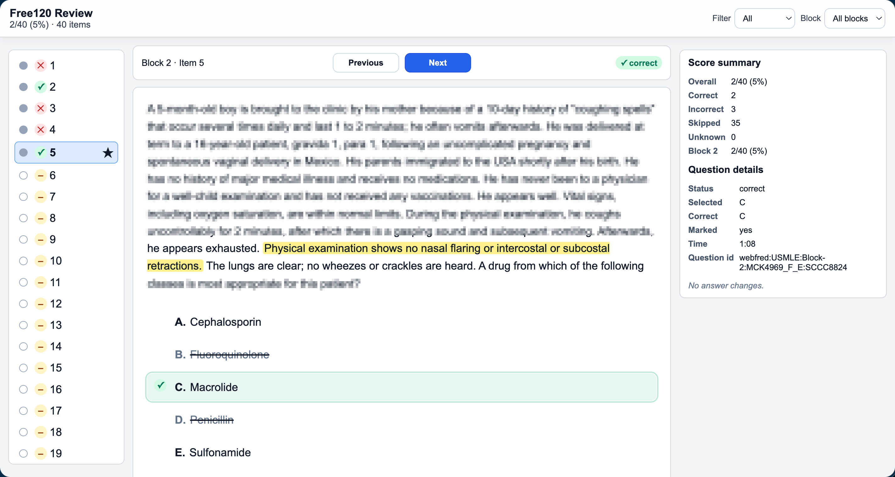

# USMLE Free 120 Helper

A local-only userscript that enhances the official USMLE Free 120 practice exam experience on [orientation.nbme.org](https://orientation.nbme.org). It adds a review mode after the exam ends, allowing you to review your choices, just like any other modern Qbanks.

## Features



- **Review mode** — display all the question stems and options, including your answers, marks, and highlights. It can even show which options you hesitated on.
- **Launch history** — you can view and review all of your attempts.
- **Privacy first** — everything lives in your browser, no accounts needed.

## Installation

1. Install a userscript manager in your browser, e.g. [Violentmonkey](https://violentmonkey.github.io/)
2. Install the script from either [Greasy Fork](https://greasyfork.org/zh-CN/scripts/579853-usmle-free-120-qbank-helper) or [GitHub Releases](https://github.com/h4rvey-g/free120-helper/releases/latest/download/free120-helper.user.js)

## Usage

1. Navigate to [https://orientation.nbme.org/launch/usmle](https://orientation.nbme.org/launch/usmle).
2. **Capture QBank** (**Important**) — on the launch page, click "Capture QBank" to store answer keys locally. You can choose the specific exams you want to take, or select all (default).
3. **Take your exam** — tracking runs automatically; the pill in the corner shows progress
4. **Review** — after the exam, open local review from the button on exam end page or the history panel
5. **Export/Import** — If you want to migrate your exam records to another device, use the history panel to back up or restore attempts as JSON

## Development

### Prerequisites

- Node.js (v18+)
- npm

### Setup

```bash
npm install
```

### Build

```bash
# Production build
npm run build

# Development build (with inline sourcemaps)
npm run build:dev

# Watch mode (rebuilds on file changes)
npm run watch
```

The bundled userscript is output to `dist/free120-helper.user.js`.

### Test

```bash
# Run all tests
npm test

# Individual test suites
npm run test:review
npm run test:qbank
npm run test:storage
npm run test:adapter
npm run test:scoring
```

### Live Validation

```bash
# Run live validation against the real site (requires Playwright)
npm run live:validate
npm run live:validate:step1-all-blocks
npm run live:validate:real
```

## Project Structure

```
src/
├── main.js                 # Entry point — bootstraps based on page type
├── userscript.meta.txt     # Userscript metadata header
├── core/                   # Constants, data utilities, logger, settings
├── storage/                # IndexedDB attempt store
├── tracking/               # Exam state observation engine
├── scoring/                # Local grading logic
├── qbank/                  # QBank cache capture and lookup
├── review/                 # Review page builder and readiness checks
├── ui/                     # Launch history panel, active exam pill, DOM helpers
├── webfred/                # WebFRED site adapter
├── media/                  # Resource caching for question media
└── runtime/                # Bootstrap and runtime state management
```

## License

[PolyForm Noncommercial 1.0.0](LICENSE) — free for non-commercial use.
